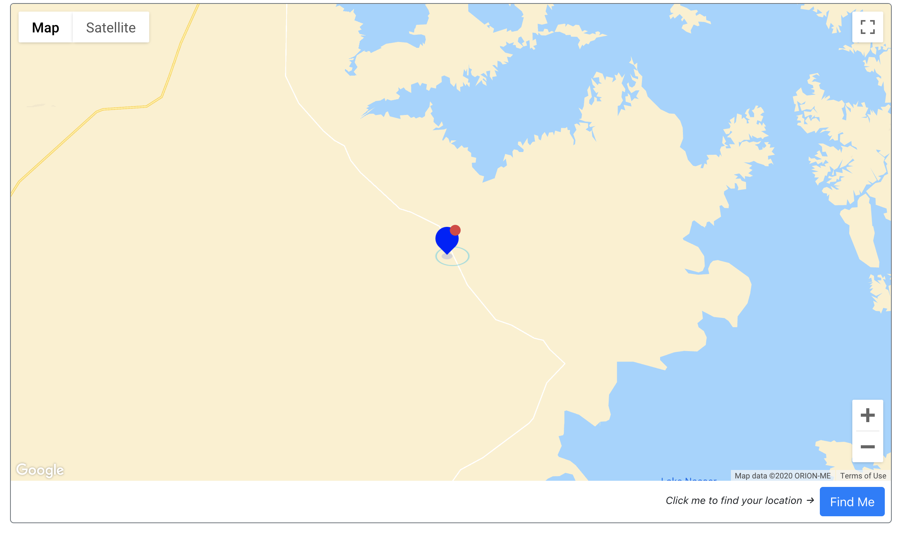
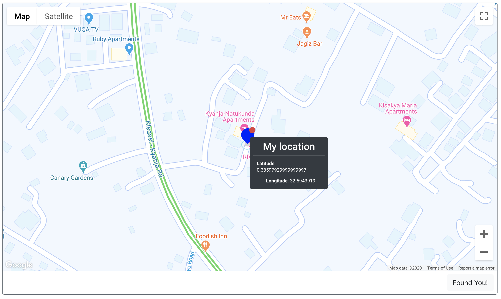

# Find Me

## A simple react app that locates a user on the Map when the find me button is clicked.

--------

Prerequisites
> Get an API key from the [Google Cloud Consoe](https://console.cloud.google.com/)

> Clone the repository, run in the terminal `git clone origin https://github.com/cdvx/find-me.git`

> Set it as an environment variable 
`REACT_APP_API_KEY`

> Install dependencies with `npm install`

> Run app with `npm run start`

## Screenshots

